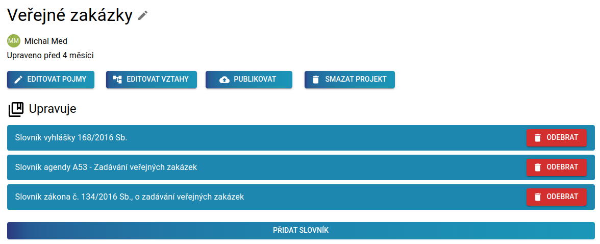

Výkon veřejné správy vychází z legislativních předpisů. Veškeré činnosti, včetně získávání, analýzy a zpracování dat, vychází z platných legislativních předpisů, včetně popisu samotných údajů. Pojmy použité v legislativě by tedy měly být jednoznačně definované. Ale je tomu skutečně tak?

Jenom slovo "budova" se vyskytuje v zákonech v několika různých významech, např. v [Katastrálním zákoně](https://www.zakonyprolidi.cz/cs/2013-256#p2-1-l) zahrnuje i nevyhřívané objekty, zatímco v [Zákoně o hospodaření energií](https://www.zakonyprolidi.cz/cs/2000-406#p2-1-p) nikoliv. Podle definice lze tedy rozlišit nejméně dva významy tohoto slova. Slovu se specifických významem v daném kontextu říkáme _pojem_. Slovo "budova" tedy může být vyjádřeno nejméně dvěma pojmy a tyto pojmy je potřeba rozlišit. Proč? Představte si nařízení, které zavádí speciální daň z budovy. Jak zjistíte, jestli se to týká budov podle katastrálního zákona, nebo zákona o hospodaření energií? Stejně tak je potřeba rozlišit datové sady poskytující data o budovách podle různých kontextů. Ani z výzedků vyhledávání slova "budova" v [Národním katalogu otevřených dat](https://data.gov.cz/datov%C3%A9-sady?dotaz=budovy)) není možné jednoznačně rozlišit, o kterých budovách která datová sada je.

Řešením tohoto problému je Sémantický slovník pojmů -- znalostní graf, který pracuje s _pojmy_ v konkrétním kontexru. Takový _pojem_ si představme jako slovo nebo sousloví s jednoznačně danou definicí a jejím zdrojem. Zdrojem je například znění zákona, nebo konkrétní paragraf v tomto zákoně. Zdrojem ale může být i obecná znalost, například význam pojmu tak, jak mu rozumí a používá ho určitá skupina expertů. _Pojem_ může být pojmenován pomocí synonym a _pojmy_ jsou mezi sebou propojeny prostřednictvím významových vazeb. Příkladem významové vazby je specializace, kdy _pojem_ "Budova" je speciálním případem _pojmu_ "Stavba", ale významovou vazbou je i vztah "budovy" a její vlastnosti (například "číslo popisné" je také _pojmem_). Tyto významové vazby umožňují odvozovat vlastnosti _pojmů_ a kontrolovat, že _pojmy_ nejsou ve vzájemném rozporu.

Datové typy a atrobuty popsané v [otevřených formálních normách](https://opendata.gov.cz/otev%C5%99en%C3%A9-form%C3%A1ln%C3%AD-normy:start) (OFN), jsou ve skutečnosti také reprezentovány pojmy z SSP. Např. OFN [Lidé a osoby](https://ofn.gov.cz/lid%C3%A9-a-osoby/2020-07-01/) definuje datovou strukturu pro popis osob. Vytvoříte-li záznam o osobě, bude se tím rozumět osoba ve smyslu [Zákona o základních registrech](https://www.zakonyprolidi.cz/cs/2009-111#p25), která bude reprezentována jako pojem [Osoba (Zákon o základních registrech)](https://slovník.gov.cz/legislativní/sbírka/111/2009/pojem/osoba). Ten má svojí lidsky čitelnou a strojově čitelnou reprezentaci a umožní tak uživatelům vašich dat tato data lépe nalézt, porozumět jim a integrovat do svých aplikací. Využití je ovšem mnohem širší - formální vazby v SSP umožňují třeba kontrolovat, zda jsou pojmy napříč legislativou používány konzistentně. Formální jazyky, ve kterých je sémantický slovník pojmů vyjádřen, umožňují na základě slovníků automatizovaně generovat konceptuální datových modelů (např. pro popis [datové architektury veřejné správy](https://archi.gov.cz/nar-dokument:architektonicke_uloziste_a_nastroj)), a to ve strojově čitelné podobě a s vazbou na konkrétní legislativu.

## Prohlížení, vytváření a využití sémantického slovníku pojmů

 
 | 

  | 

:----------------:|:---------------:|:--------------:
Systém ShowIt umožňuje intuitivní vyhledávání pojmů Sémantického slovníku pojmů. Pojmy sdružuje podle klíčových slov, ale i podle slovníků a podle jejich vzájemných vztahů. | Výrobní linka slouží k vytváření a editaci slovníků a k jejich následné publikaci. Součástí výrobní linky jsou v současné době nástroje Mission Control pro vytváření slovníků, TermIt pro tvorbu glosářů -- tedy seznamu pojmů patřících do jednoho slovníku, jejich podrobného popisu a základních vztahů mezi pojmy -- a OntoGrapher pro samotné modelování. | Na základě publikovaných slovníků je možné pomocí nástroje Dataspecer generovat datové specifikace. Datová specifikace obsahuje textovou část a konceptuální model a díky tomu, že vzniká na základě sémantických slovníků je dokonale lidsky i strojově čitelná.

## Detaily sémantického slovníku pojmů

V rámci projektu vznikly dokumenty [Koncepce sémantického slovníku pojmů pro potřeby konceptuálního datového modelování agend](https://drive.google.com) a [Metodika tvorby a údržby sémantického slovníku pojmů veřejné správy](https://drive.google.com)
Dokumenty popisují principy toto, co je to sémantický slovník a jak ho vytvářet a udržovat pomocí nástrojů výrobní linky.

Obsah celého S0mantického slovníku pojmů je přístupný i přes [SPARQL endpoint](https://slovník.gov.cz/sparql), ve kterém je dostupná vždy aktuální verze slovníku. Sémantický slovník pojmů je udržován v repozitáři na GitHubu, přes který můžete [pokládat otázky a hlásit chyby](https://github.com/opendata-mvcr/ssp/issues).

----
Tato stránka je udržována v rámci projektu OPZ č. [CZ.03.4.74/0.0/0.0/15_025/0013983](https://esf2014.esfcr.cz/PublicPortal/Views/Projekty/Public/ProjektDetailPublicPage.aspx?action=get&datovySkladId=F5E162B2-15EC-4BBE-9ABD-066388F3D412).

%
